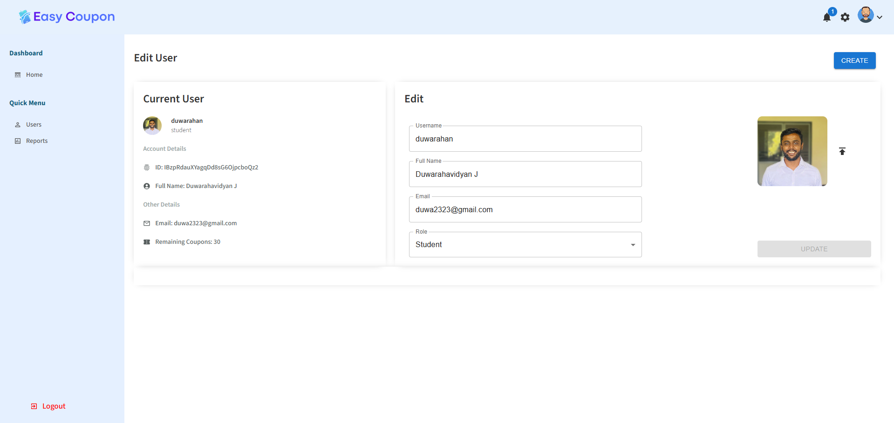
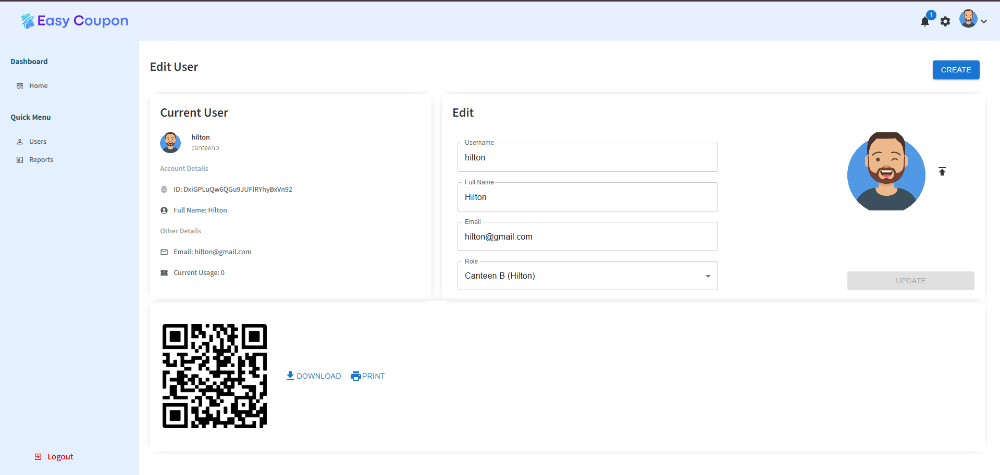
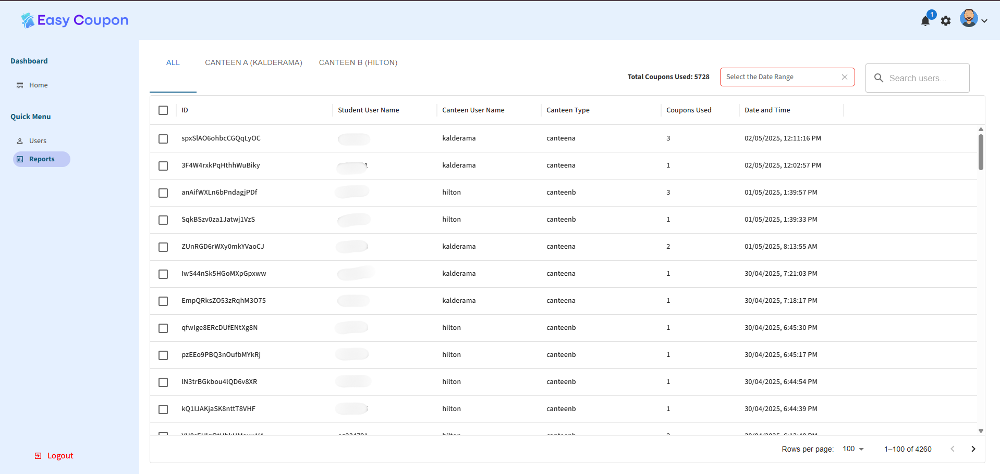
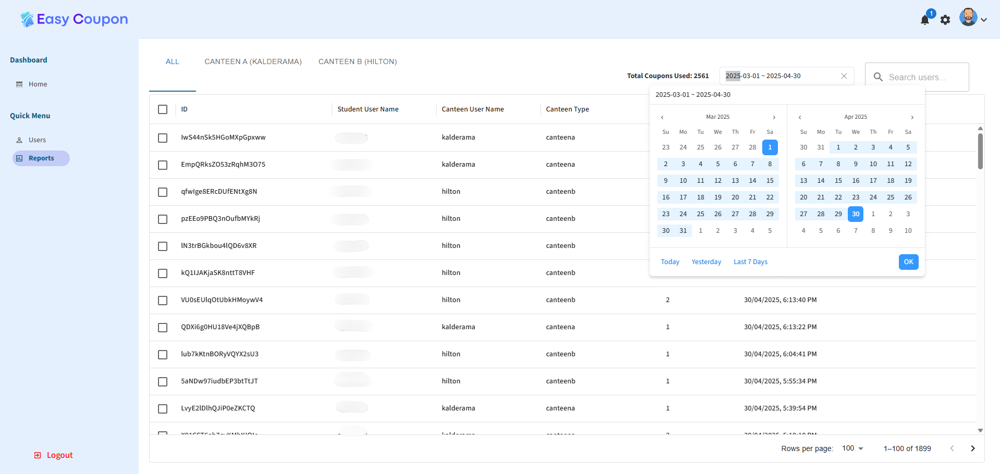
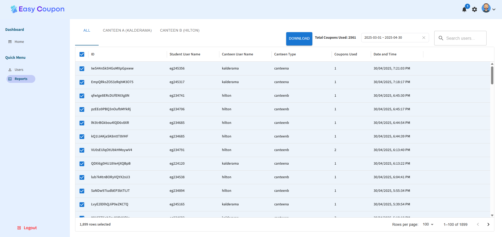

<!-- ---------------------------------------------------------------- -->
<!-- 🌐 PROJECT HEADER -->
<!-- ---------------------------------------------------------------- -->

<h1 align="center">
  
  
  <br>
  💻 <span style="color:#007acc">Easy Coupon Web Application</span> 💻  
</h1>

<h3 align="center">🖥️ The Admin Portal for Welfare Food Coupon Management</h3>

<p align="center">
  <em>Developed for the Faculty of Engineering, University of Ruhuna</em>  
</p>

<p align="center">
  
  
  
  
  
  
</p>


---

<!-- ---------------------------------------------------------------- -->
<!-- 🌍 INTRODUCTION -->
<!-- ---------------------------------------------------------------- -->

## 🌟 Introduction  

At the **Faculty of Engineering, University of Ruhuna**, the **Welfare Society** runs a coupon reimbursement program to provide free meals 🍛 to financially unstable students.  

However, the previous **paper coupon system** was inefficient and prone to issues like loss, fraud, and time delays.  
To modernize this, our team developed **Easy Coupon**, a **mobile + web-based platform** that automates welfare food coupon distribution and redemption.

---

## 🔴 The Problem  

Originally, physical coupons were used, leading to:

- 📄 Inefficient distribution & manual tracking  
- ⏳ Long queues and delays at canteens  
- ❌ Risk of fraud, duplication, or lost coupons  
- 📉 Lack of real-time analytics for administrators

---

## 💡 The Solution – Easy Coupon  

**Easy Coupon** revolutionizes the coupon reimbursement system through a secure, efficient, and paperless digital platform.  

### 📱 *Mobile Application (Flutter + BLoC + Firebase) 🔥*  
- ⚙️ Powered by **Flutter + BLoC Architecture** for responsive and scalable UI state management.  
- 📸 Students **scan QR codes** at canteens to redeem meals instantly — no paper, no delay.  
- 🔐 All transactions are **encrypted with AES-256** for military-grade security.  
- 🔑 **Firebase Authentication** ensures safe, role-based access and activity logging.  
- ⚡ **Google Cloud Functions** automatically reset coupons each month — zero manual work.  
- 🔄 **Real-time sync** between student devices and canteen dashboards via Firebase Firestore.  
- 🎨 Clean, modern UI with smooth animations, designed for simplicity and speed.
  
<h4 align="center">🌐 Explore the Easy Coupon Mobile Application</h4>

<p align="center">
  👉 <a href="https://github.com/JDuwarahavidyan/EasyCoupon-Mobile-New-UI.git" target="_blank"><b>Visit the Mobile Application Repository on GitHub</b></a> 👈
</p> 

### 🖥️ **Admin Web Application – React.js + Node.js + Express.js**
- 🧩 **Student & Canteen Management** – Approve, reject, or update welfare program participants effortlessly.  
- ⚙️ **Full CRUD Operations** – Add, edit, or remove users, coupons, and canteens in real time.  
- 📊 **Dynamic Reports & Analytics** – Generate and download redemption reports for any selected date range.  
- 📈 **Live Dashboard Insights** – View real-time updates on coupon usage and canteen activity.  
- 🔒 **Secure Access Control** – Role-based authentication ensures only authorized administrators can modify data.


 

---

### 💡 **Digital Revolution**
Transforming a manual welfare process into a **smart, mobile-first digital ecosystem** with automation and transparency.

---

## 🖥️ Web Application Overview

<h3 align="center">💙 “Empowering Administration with Insight, Control, and Efficiency.” 💙</h3>

<p align="center">
  
  
  
  
  
</p>


---

### 🧠 Built With  

| Layer | Technology |
|-------|-------------|
| **Frontend** | React.js (JavaScript, Context API) |
| **Backend** | Node.js, Express.js |
| **Database & Authentication** | Firebase Firestore, Firebase Auth |
| **Hosting & Cloud Functions** | Firebase Hosting, Google Cloud Functions |
| **Version Control** | Git + GitHub |
| **IDE / Tools** | Visual Studio Code, Postman, npm |


### 🗂️ Folder Structure

```
📦 easy_coupon_web_app/
│
├── 📁 admin/ # React-based admin dashboard
│ ├── 📁 build/ # Production build files
│ ├── 📁 node_modules/ # Frontend dependencies
│ ├── 📁 public/ # Static assets (favicon, index.html)
│ └── 📁 src/ # Main source code
│ ├── 📁 components/ # Reusable UI components
│ │ ├── chart/ # Chart components (reports & analytics)
│ │ ├── featuredInfo/ # Highlight metrics widgets
│ │ ├── sidebar/ # Sidebar navigation
│ │ ├── topbar/ # Top navigation bar
│ │ ├── widgetLg/ # Large dashboard widgets
│ │ └── widgetSm/ # Small dashboard widgets
│ │
│ ├── 📁 context/ # React Context API state management
│ │ ├── authContext/ # Authentication state and provider
│ │ ├── qrCodeContext/ # QR data and scanning logic
│ │ └── userContext/ # User and role-based state
│ │
│ ├── 📁 pages/ # Application pages (routes)
│ │ ├── home/ # Dashboard overview
│ │ ├── login/ # Admin login page
│ │ ├── newUser/ # Add new users and canteens
│ │ ├── pwReset/ # Password reset page
│ │ ├── qrCodeList/ # Manage and view QR codes
│ │ ├── user/ # Single user view
│ │ └── userList/ # List of users
│ │
│ ├── 📄 App.js # Root React component
│ ├── 📄 firebase.js # Firebase config for auth & Firestore
│ ├── 📄 index.js # Entry point for React
│ ├── 📄 app.scss # Global styles
│ ├── 📄 .env # Environment variables
│ └── 📄 setupTests.js # Testing configurations
│
│
├── 📁 api/ # Backend API (Node.js + Express)
│ ├── 📁 functions/ # Firebase Cloud Functions setup
│ │ ├── index.js # Entry point for deployed functions
│ │ ├── package.json # Cloud Functions dependencies
│ │ └── .eslintrc.js # Linting rules
│ │
│ ├── 📁 models/ # Mongoose models for QR & User
│ │ ├── QR.js
│ │ └── User.js
│ │
│ ├── 📁 routes/ # Express routes
│ │ ├── auth.js # Authentication routes (login/signup)
│ │ ├── qr.js # QR code management routes
│ │ └── users.js # User management routes
│ │
│ ├── 📄 firebase.js # Firebase Admin SDK config
│ ├── 📄 mail.js # Email service for notifications
│ ├── 📄 verifyToken.js # Middleware for JWT verification
│ ├── 📄 service_account.json # Firebase credentials
│ ├── 📄 index.js # API server entry point
│ ├── 📄 .env # Backend environment variables
│ ├── 📄 package.json # Backend dependencies
│ └── 📄 firebase.json # Firebase hosting configuration
│
├── 📄 package-lock.json # Lock file for npm dependencies
├── 📄 README.md # Project documentation
└── 📄 .gitignore # Git ignore rules
```
---

<!-- ---------------------------------------------------------------- -->
<!-- 🎬 APP PREVIEW SECTION -->
<!-- ---------------------------------------------------------------- -->

## 🎬 Web App Preview  

### 🏠 Home Dashboard – Admin Overview  

 The **Easy Coupon Web Application** provides administrators with a comprehensive, real-time dashboard that visualizes platform activity and user engagement.  
  
 📈 The **User Analytics graph** displays monthly user registrations, helping admins monitor growth trends.  
 👥 The **New Join Members** section highlights recently added students or canteen operators for quick review.  
 🧾 The **Other Details** panel lists user information such as email, account creation date, and last update activity ensuring complete transparency and management control.  

<p align="center">
  
</p>

---

### 👥 User Management Page  

The **User Management Page** empowers administrators to efficiently handle all registered accounts within the Easy Coupon system. Admins can easily **view**, **filter**, **enable/disable**, or **delete** users, ensuring secure and controlled access to the welfare food coupon platform.  

#### 🔧 Key Features  
- 📋 **Comprehensive User Table** – Displays user details such as ID, name, email, role, and status.  
- 🧩 **Filter by Role** – Instantly filter between *Students*, *Canteen Operators*, and *Admins*.  
- 🟢 **Enable / Disable Accounts** – Toggle user access permissions with a single click.  
- 🗑️ **Remove Unused Accounts** – Delete inactive or unauthorized users to maintain database hygiene.  
- 🔍 **Search Functionality** – Quickly find users by name or email using the built-in search bar.  

<p align="center">
  
</p>


---
### ➕ User Creation Page  

The **User Creation Page** allows administrators to easily onboard new users into the Easy Coupon system. They can either **add single users manually** or **upload multiple users in bulk** using a pre-formatted Excel file. This feature saves time and ensures consistency across user registration, making large-scale data handling simple and error-free.  

#### ✨ Key Features  
- 👤 **Single User Creation** – Enter the username, full name, email, and select a role (*Student*, *Canteen*, or *Admin*).  
- 📦 **Bulk User Upload** – Upload a `.xls` or `.xlsx` file to create multiple users at once.  
- 📥 **Download Sample Format** – Download a sample document to ensure correct column formatting before upload.  
- ⚙️ **Role Assignment** – Assign roles to users during creation for immediate access-level control.  

<p align="center">
  
</p>


---

### ✏️ Edit User Page  

The **Edit User Page** enables administrators to update and manage existing user profiles within the Easy Coupon system. Admins can modify user details such as **username, full name, email, and role**, and even **update the profile picture** directly through the dashboard. This ensures that all user information stays current, verified, and well-maintained.  

#### ✨ Key Features  
- 🧩 **Profile Editing** – Modify username, full name, email, and role for any registered user.  
- 🖼️ **Profile Picture Update** – Upload or change the user’s display photo with ease.  
- 🧾 **Account Overview** – View complete user details, including ID, email, and remaining monthly coupons.  
- ⚙️ **Role Reassignment** – Instantly switch roles (*Student*, *Canteen*, or *Admin*) for better access control.  
- 💾 **Real-time Updates** – All changes are saved instantly to Firebase, ensuring system-wide consistency.  

<p align="center">
  
</p>


---
### 📷 QR Generation for Canteens  

The **QR Generation Page** enables administrators to create unique, encrypted QR codes for each canteen. These QR codes function identically to those generated within the mobile app ensuring a unified, secure coupon redemption process across all platforms. Once generated, the admin can **download** or **print** the QR directly from the dashboard and provide it to the respective canteen for daily display or scanning by students.  

#### ✨ Key Features  
- 🔐 **AES-Encrypted QR Codes** – Each QR is encrypted for secure validation within the Easy Coupon ecosystem.  
- 🏪 **Canteen-Specific Codes** – Unique QR codes are generated per canteen (e.g., *Canteen A*, *Canteen B*).  
- 🖨️ **Download & Print Options** – Admins can download or print the QR code instantly for physical use.  
- ⚙️ **Unified Verification System** – Works seamlessly with the mobile QR scanner for redemption tracking.  
- ☁️ **Data Synced with Firebase** – Generated QR data is securely stored in Firebase for consistency and auditing.  

<p align="center">
  
</p>

---


### 📊 Reports Page  

The **Reports Page** provides administrators with powerful tools to analyze and track coupon redemptions across all canteens. Admins can view detailed logs of coupon usage, filter data by **specific date ranges**, and download filtered reports for documentation or analysis. The reporting system ensures **data transparency** and supports easy export for welfare and audit purposes.  

#### ✨ Key Features  
- 📅 **Date Range Filtering** – Select any date range to view coupon redemptions within that period.  
- 🏪 **Canteen-Based Reports** – Switch between *Canteen A*, *Canteen B*, or *All* to view specific usage data.  
- 📈 **Total Coupons Counter** – Instantly view the total number of coupons redeemed in the selected range.  
- 📂 **CSV Export** – Download filtered reports as a `.csv` file for record-keeping and offline review.  
- 🔍 **Search Functionality** – Quickly find reports by student name, canteen name, or date.  

<p align="center">
  
  <br><br>
  
  <br><br>
  
</p>


---
## 🎬 Live Action with Easy Coupon

> _A real-world demonstration of how Easy Coupon brings automation, convenience, and transparency to the Faculty canteen._

---

### 🏪 **Step 1 – QR Code at the Canteen**
The **canteen operator** places a printed or digital **AES-encrypted QR code** near the counter. Students simply walk up and scan this QR using the Easy Coupon app — no paper coupons needed!

<p align="center">
  
</p>

---

### 📲 **Step 2 – Scanning the QR Code**
Students open the app, choose how many coupons to redeem *(up to 3 per day)*, and scan the QR code to initiate the redemption securely.

<p align="center">
  
</p>

---

### ✅ **Step 3 – Instant Confirmation**
The system instantly validates the scan and shows a **confirmation screen**. The redeemed amount is auto-deducted from the student’s monthly quota and reflected in the canteen dashboard in real time.

<p align="center">
  
</p>

---

### 👩‍🍳 **Step 4 – Show Confirmation to the Canteen Operator**
The student presents the confirmation screen to the operator, verifying that the meal redemption is complete and recorded.

<p align="center">
  
</p>

---

### 🍱 **Step 5 – Receiving the Meal**
After verification, the canteen operator serves the meal 🍛 — completing a **secure, paper-free, end-to-end digital transaction** powered by Easy Coupon.

<p align="center">
  
</p>

---


## 🌟 The Impact of Easy Coupon

> _Transforming a simple idea into a digital revolution at the Faculty of Engineering, University of Ruhuna._

---

### 🎯 **Key Achievements**

| 🌱 | **Outcome** |
|:--:|:-------------|
| ⚙️ | **Reduced Manual Workload** – Automated the entire coupon reimbursement workflow, reducing manual effort for students and canteen operators by **over 90%**. |
| 🧾 | **Paperless Transformation** – Eliminated the need for printed coupons, saving **hundreds of sheets per month** and contributing to a greener campus 🌿. |
| 📊 | **Real-time Transparency** – Enabled the Welfare Society to **monitor coupon usage and canteen activity live**, with monthly report generation. |
| 🔐 | **Secure & Reliable** – Leveraged **AES-256 encryption**, Firebase authentication, and Google Cloud Functions for complete system security and automation. |
| 🚀 | **Scalable Foundation** – Built a framework that can be **replicated across universities** to modernize welfare food distribution systems nationwide. |

---

## 💬 Words of Appreciation

This project was completed under the supervision and guidance of **[Dr. Kushan Sudheera](https://www.eng.ruh.ac.lk/deie/team/kushan-sudheera/)**,  
_Senior Lecturer, Department of Electrical and Information Engineering,_  
_Faculty of Engineering, University of Ruhuna._

A special thanks to the **Welfare Society of the Faculty of Engineering** for their support, testing, and real-world feedback during deployment.

Gratitude also goes to all **canteen operators and students** who participated in pilot testing and helped us refine the system into a practical success. 🙏

---


## 👨‍💻 Project Contributors  

> _A passionate and dedicated team behind the Easy Coupon System_ 💚  


| 👨‍🎓 **Contributor** | 💼 **Role** | 🌐 **GitHub Profile** |
|:---------------------|:-------------------------------------|:----------------------------------------------------|
| **Duwarahavidyan Jeganathan** | 🧭 Project Manager & Fullstack Developer | [@JDuwarahavidyan](https://github.com/JDuwarahavidyan) |
| **Sachinthana Fernando** | 💻 Fullstack Developer | [@sfernando00](https://github.com/sfernando00) |
| **Deshan Dissanayake** | 🧩 Fullstack Developer | [@DeshanTD](https://github.com/DeshanTD) |
| **Tharuka Harshajith** | 🧠 Fullstack Developer | [@TharukaHarshajith](https://github.com/TharukaHarshajith) |


---

## 🔗 Explore More

### 📱 **Easy Coupon Mobile Application**
📲 Explore the student and canteen mobile experience — built using **Flutter**, **Firebase**, and **BLoC Architecture**  
👉 [View on GitHub](https://github.com/JDuwarahavidyan/EasyCoupon-Mobile-New-UI.git)


### 🎬 **Easy Coupon Mobile App Demo**
📱 A hands-on walkthrough of the Flutter + Firebase powered mobile application.  
👉 [Watch the Full Demo](https://drive.google.com/file/d/15aHMUjwTxR9I2h3rzv2fBgldVgAmwlbH/view?usp=sharing)


### 🎥 **Coupon Redemption Live Demo**
🍽️ See the complete coupon redemption flow, from QR generation to meal confirmation.  
👉 [View Redemption Demo](https://drive.google.com/file/d/1-z_r3Jxu-lJzZORPqzC_APLQIEcK_52C/view?usp=sharing)


### 💼 **Full Project Story on LinkedIn**
🧠 Learn how our team built, tested, and deployed Easy Coupon for the Faculty of Engineering.  
👉 [Read the Full Post on LinkedIn](https://www.linkedin.com/posts/duwarahavidyan-jeganathan-763b6a192_flutter-firebase-reactjs-activity-7369382950934597679-Cmbt?utm_source=share&utm_medium=member_desktop&rcm=ACoAAC1g0bsBkCY5HOF6iQ3bbHqumfI0SOo0-Dk)


### 🏆 **Appreciation Post**
🙏 See how our project was recognized and appreciated by faculty members and the Welfare Society.  
👉 [View Appreciation Post](https://www.linkedin.com/posts/duwarahavidyan-jeganathan-763b6a192_easycoupon-universityofruhuna-innovation-activity-7390787090575257600-7a8M?utm_source=share&utm_medium=member_desktop&rcm=ACoAAC1g0bsBkCY5HOF6iQ3bbHqumfI0SOo0-Dk)
  

---

<h4 align="center">🌟 Smart • Secure • Sustainable – The Easy Coupon Experience in Real Life 🌟</h4>


<p align="center">
  
  &nbsp;
  
  &nbsp;
  
</p>

